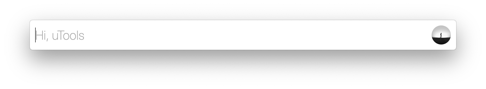
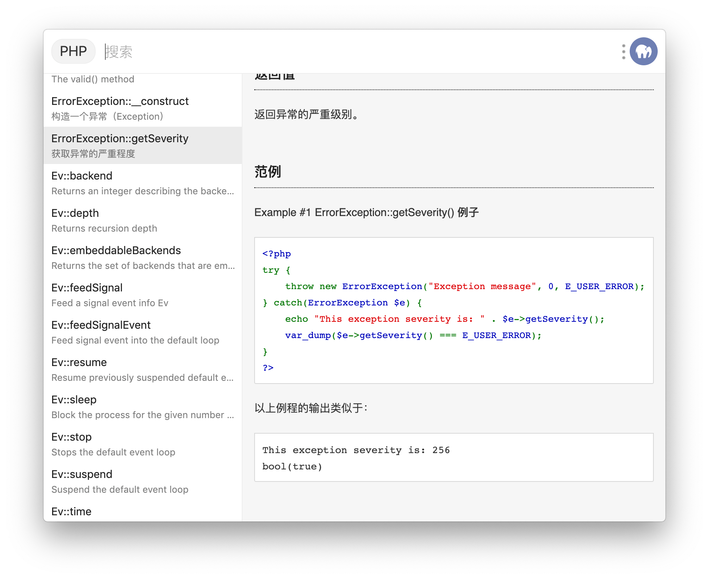

# uTools API

在插件初始化完成时，uTools 会自动在你的 window 对象上挂载 utools 对象，它将提供一些特有的 api，使你的插件能够更好的与uTools 主窗口沟通，并获得一些有意义的底层能力。

## 事件
你可以根据需要，事先定义好一些回调函数，uTools 会在事件产生时主动调用它们。

### `onPluginReady(callback)`
- `callback` Function  
> 当插件装载成功，uTools 将会主动调用这个方法（生命周期内仅调用一次），所有的 api 都应该在 onPluginReady 之后进行调用。
#### 示例
```js
utools.onPluginReady(() => {
  console.log('插件装配完成，已准备好')
})
```

### `onPluginEnter(callback)`
- `callback` Function  
  - `Object`
    - `code` String
      
      > plugin.json 配置的 feature.code
    - `type` String
      
      > plugin.json 配置的 feature.cmd.type，可以为 "text"、"img"、 "files"、 "regex"、 "over"、"window"
    - `payload` String | Object | Array
      
      > feature.cmd.type 对应匹配的数据
    - `optional` Array | undefined
      
      > 存在多个匹配时的可选匹配类型和数据 [{ type, payload }]
> 每当插件从后台进入到前台时，uTools 将会主动调用这个方法。
#### 示例
```js
utools.onPluginEnter(({code, type, payload, optional}) => {
  console.log('用户进入插件', code, type, payload)
})

/* 
type 为 "files" 时， payload 值示例
[
	{
		"isFile": true,
		"isDirectory": false,
		"name": "demo.js",
		"path": "C:\\demo.js"
	}
]

type 为 "window" 时， payload 值示例
{
	"id": 264584,
	"class": "Chrome_WidgetWin_1",
	"title": "demo",
	"x": -8,
	"y": -8,
	"width": 1936,
	"height": 1056,
	"appPath": "C:\\demo.exe",
	"pid": 232,
	"app": "demo.exe"
}

type 为 "img" 时， payload 值示例
data:image/png;base64,...

type 为 "text"、"regex"、 "over" 时， payload 值为进入插件时的主输入框文本
*/
```

### `onPluginOut(callback)`
- `callback` Function  
> 每当插件从前台进入到后台时，uTools 将会主动调用这个方法。
#### 示例
```js
utools.onPluginOut(() => {
  console.log('用户退出插件')
})
```

### `onPluginDetach(callback)`
- `callback` Function
> 用户对插件进行分离操作时，uTools 将会主动调用这个方法。
#### 示例
```js
utools.onPluginDetach(() => {
  console.log('插件被分离')
})
```

### `onDbPull(callback)`
- `callback` Function  
> 当此插件的数据在其他设备上被更改后同步到此设备时，uTools 将会主动调用这个方法
#### 示例
```js
utools.onDbPull(() => {
  console.log('onDbPull')
})
```

## 窗口交互

### `hideMainWindow(isRestorePreWindow)`
- `isRestorePreWindow` Boolean 
  
  > 是否焦点回归到前面的活动窗口，默认 true
- `返回` Boolean
> 执行该方法将会隐藏 uTools 主窗口，包括此时正在主窗口运行的插件，分离的插件不会被隐藏。
#### 示例
```js
utools.hideMainWindow()
```

### `showMainWindow()`
- `返回` Boolean
> 执行该方法将会显示 uTools 主窗口，包括此时正在主窗口运行的插件。
#### 示例
```js
utools.showMainWindow()
```

### `setExpendHeight(height)`
- `height` Integer  
- `返回` Boolean
> 执行该方法将会修改插件窗口的高度。
#### 示例
```js
utools.setExpendHeight(100)
```

### `setSubInput(onChange, placeholder, isFocus)`
- `onChange` Function
  - `Object`
    - `text` String
  > 子输入框文本修改时触发
- `placeholder` String (可选)
  
  > 子输入框占位符
- `isFocus` Boolean (可选)
  
  > 子输入框是否获得焦点，默认 true
- `返回` Boolean
> 设置子输入框，进入插件后，原本 uTools 的搜索条主输入框将会变成子输入框，子输入框可以为插件所使用。  


<p align="center">主输入框</p>

<p align="center">子输入框</p>
#### 示例
```js
utools.setSubInput(({ text }) => {
  console.log(text)
}, '搜索')
```

### `removeSubInput()`
- `返回` Boolean
> 移除已经设置的子输入框，在插件切换到其他页面时可以重新设置子输入框为其所用。
#### 示例
```js
utools.removeSubInput()
```

### `setSubInputValue(value)`
- `value` String
- `返回` Boolean  
> 直接对子输入框的值进行设置。
#### 示例
```js
utools.setSubInputValue('uTools')
```

### `subInputFocus()`
- `返回` Boolean  
> 子输入框获得焦点
#### 示例
```js
utools.subInputFocus()
```

### `subInputSelect()`
- `返回` Boolean
> 子输入框获得焦点并选中
#### 示例
```js
utools.subInputSelect()
```

### `subInputBlur()`
- `返回` Boolean 
> 子输入框失去焦点，插件获得焦点
#### 示例
```js
utools.subInputBlur()
```

### `outPlugin()`
- `返回` Boolean 
> 执行该方法将会退出当前插件。（插件进入后台，进程并未结束）
#### 示例
```js
utools.outPlugin()
```

### `redirect(label, payload)`
- `label` String
  
  > feature.cmd.label 名称
- `payload` String | Object
  
  > feature.cmd.type 对应的数据
- `返回` Boolean
> 该方法可以携带数据，跳转到另一个插件进行处理，如果用户未安装对应的插件，uTools 会弹出提醒并引导进入插件市场下载。
#### 示例
```js
//content 为string类型
utools.redirect('翻译', 'hello world')

//content 为object类型
utools.redirect('翻译', {
	'type': 'text',
	'data': 'hello world'
})

//传递图片
utools.redirect('图片识别', {
	'type': 'img',
	// data 可以是本地图片路径、base64编码的图片、Buffer对象
	'data': '/path/to/img.jpg(支持jpeg|png|bmp)' //filePath、base64、Buffer
})

//传递文件、文件夹
utools.redirect('图片压缩', {
	'type': 'files',
	// data 可以是本地文件、文件夹路径
	'data': '/path/to/img.jpg' //filePath、array
	//'data': ['path1', 'path2'] //支持数组
})
```

### `showOpenDialog(options)`
- `options` Object
  
  > 与 [Electron API dialog.showOpenDialogSync](https://www.electronjs.org/docs/api/dialog#dialogshowopendialogsyncbrowserwindow-options) options 一致
- `返回` Array | undefined
  
  > 返回选择的文件数组，用户取消返回 undefined
> 弹出文件选择框
#### 示例
```js
utools.showOpenDialog({ 
  filters: [{ 'name': 'plugin.json', extensions: ['json'] }], 
  properties: ['openFile'] 
})
```

### `showSaveDialog(options)`
- `options` Object
  
  > 与 [Electron API dialog.showSaveDialogSync](https://www.electronjs.org/docs/api/dialog#dialogshowsavedialogsyncbrowserwindow-options) options 一致
- `返回` String | undefined
  
  > 返回选择的路径，用户取消返回 undefined
> 弹出文件保存框
#### 示例
```js
utools.showSaveDialog({ 
  title: '保存位置', 
  defaultPath: utools.getPath('downloads')
  buttonLabel: '保存'
})
```

### `showMessageBox(options)`
- `options` Object
  
  > 与 [Electron API dialog.showMessageBoxSync](https://www.electronjs.org/docs/api/dialog#dialogshowmessageboxsyncbrowserwindow-options) options 一致
- `返回` Integer
  
  > 返回点击按钮的索引
> 弹出消息框
#### 示例
```js
utools.showMessageBox({
  type: 'question',
  buttons: ['取消', '关机'],
  title: '关机确认',
  message: '电脑确定要关机?',
  defaultId: 1
})
```

### `findInPage(text, options)`
- `text` String
  
  > 要搜索的内容(必填)
- `options` Object (可选)
  
  > 与 [Electron API contentsfindinpagetext-options](https://www.electronjs.org/docs/api/web-contents#contentsfindinpagetext-options) options 一致
> 插件页面中查找内容
#### 示例
```js
utools.findInPage('utools')
```

### `stopFindInPage(action)`
- `action` String
  
  > "clearSelection" | "keepSelection" | "activateSelection", 默认 "clearSelection"
  >
  > 与 [Electron API contentsstopfindinpageaction](https://www.electronjs.org/docs/api/web-contents#contentsstopfindinpageaction) 一致
> 停止插件页面中查找
#### 示例
```js
utools.stopFindInPage()
```

### `startDrag(file)`
- `file` String | Array
  
  > 文件路径 或 文件路径集合
> 原生拖拽文件到其他窗口
#### 示例
```js
utools.startDrag('/path/to/file')
```

### `createBrowserWindow(url, options, callback)`
- `url` String
  
  > 相对路径的 html 文件
- `options` Object
  
  > 与 [Electron API new BrowserWindow](https://www.electronjs.org/docs/api/browser-window#new-browserwindowoptions) 参数一样，注意：preload 需配置相对位置
- `callback` Function (可选)
  
  > `url` 加载完成时回调
- `返回` Object
  
  > 返回 uTools API 构建的 [BrowserWindow](https://www.electronjs.org/docs/api/browser-window) 对象。 *保留了大部分实例方法*
> 创建浏览器窗口
#### 示例
```js
const ubWindow = utools.createBrowserWindow('test.html', {
  show: false,
  title: '测试窗口',
  webPreferences: {
    preload: 'preload.js'
  }
}, () => {
  // 显示
  ubWindow.show()
  // 置顶
  ubWindow.setAlwaysOnTop(true)
  // 窗口全屏
  ubWindow.setFullScreen(true)
  // 向子窗口传递数据
  ubWindow.webContents.send('ping')
  require('electron').ipcRenderer.sendTo(ubWindow.webContents.id, 'ping')
  // 执行脚本
  ubWindow.executeJavaScript('fetch("https://jsonplaceholder.typicode.com/users/1").then(resp => resp.json())')
    .then((result) => {
      console.log(result) // Will be the JSON object from the fetch call
    })
})
console.log(ubWindow)
```

```js
// 在新建窗口 JavaScript 中接收父窗口传递过来的数据
const { ipcRenderer } = require('electron')
ipcRenderer.on('ping', (event, data) => {
    console.log(event);
    console.log(data);
})
```

### `isDarkColors()`

> 是否深色模式
#### 示例
```js
utools.onPluginEnter(({code, type, payload}) => {
  document.body.className = utools.isDarkColors() ? 'dark-mode' : ''
})
```

## 动态增减功能
很多时候，插件中会提供一些功能供用户进行个性化设置（例如：`网页快开`插件），这部分配置无法在 `plugin.json` 事先定义好，所以我们提供了以下方法对插件功能进行动态增减。

### `getFeatures()`
- `返回` Array
> 返回本插件所有动态增加的功能。
```js
const features = utools.getFeatures()
console.log(features)
```

### `setFeature(feature)`
- `feature` Object
  
  > 格式与 `plugin.json` 中配置的格式一致
  - `code` String
  - `explain` String
  - `icon` String (可选)
  - `platform` Array (可选)
  - `cmds` Array
- `返回` Boolean  
> 为本插件动态新增某个功能。
```js
utools.setFeature({
  "code": "hosts",
  "explain": "hosts切换",
  // "icon": "res/xxx.png",
  // "icon": "data:image/png;base64,xxx...",
  // "platform": ["win32", "darwin", "linux"]
  "cmds": ["hosts"]
})
```

### `removeFeature(code)`
- `code` String
- `返回` Boolean
> 动态删除本插件的某个功能。
```js
utools.removeFeature('code')
```

## 用户
获取当前用户头像、昵称

### `getUser()`
- `返回` Object

  > { avatar: String, nickname: String, type: 'member' | 'user' } | null
> 获取当前用户，未登录帐号返回 `null`
```js
console.log(utools.getUser())
```

### `fetchUserServerTemporaryToken()`
- `返回` Promise

  > Promise<{ token: string, expired_at: number }>
> 获取用户服务端临时令牌，用于[获取用户基础信息接口](server-api.html#获取用户基础信息接口)
```js
utools.fetchUserServerTemporaryToken().then((ret) => {
  console.log(ret)
})
```

### `openPayment(options, callback)`
- `options`
    - `goodsId` String
      
      > 商品 ID，在 “ uTools 开发者工具” 插件中创建
    - `outOrderId` String  (可选)

      > 第三方服务生成的订单号（6 - 32 字符）
    - `attach` String (可选)

      > 第三方服务附加数据，在查询API和支付通知中原样返回，可作为自定义参数使用（最多 256 字符）
- `callback`
  
  > 支付成功后回调
> 打开支付
```js
utools.openPayment({ goodsId: 'xxxxxxxxxxxxxxxxxxxxxxxxxxxxxxxx' }, () => {
  // 用户完成支付，继续业务代码
})
```

### `fetchUserPayments()`
- `返回` Promise

  > Promise<{ order_id: string, out_order_id: string, open_id:string,  pay_fee: number, body: string, attach: string, goods_id: string, paid_at: string,created_at }[]>
> 获取用户支付记录
```js
utools.fetchUserPayments().then((ret) => {
  // 判断如果存在支付记录则继续相关业务
  console.log(ret);
  /**
  	    {
        "order_id": "ZsVSwEDoR7PPs6vWdAGplEpEpNjn8xb4", // utools 订单号
        "out_order_id": "", // 外部订单号
        "open_id": "a331127d654761ac91d086b942aae7b6", uTools 用户 ID, 对于此插件不变且唯一
        "pay_fee": 1, // 支付金额（分）
        "body": "会员1年", // 支付内容
        "attach": "", // 附加数据
        "goods_id": "6n193s7P95p9gA13786YkwQ5oxHpVW4f", // 商品 ID
        "paid_at": "2021-06-18 16:55:26", // 支付时间
        "created_at": "2021-06-18 16:55:11" // 订单生成时间
    }
  */
})
```

## 工具
屏幕取色 & 屏幕截图

### `screenColorPick(callback)`
- `callback` Function
  > 取色结束回调
  - `Object`
    - `hex` String
    - `rgb` String
> 屏幕取色
#### 示例
```js
utools.screenColorPick(({hex, rgb})=>{
  console.log(hex) // #FFFFFF
  console.log(rgb) // RGB(0, 0, 0)
})
```

### `screenCapture(callback)`
- `callback` Function
  > 截图结束回调
  - `String`
    
    > 图片的 Base64 字符串
> 屏幕截图
#### 示例
```js
utools.screenCapture(base64Str => {
  utools.redirect('识别图片中文字', { type: 'img', data: base64Str })
})
```

## 模拟
模拟敲击键盘 和 鼠标点击

### `simulateKeyboardTap(key, ...modifier)`
- `key` String
  
  > 键值
- `modifier` String (可选)
  
  > 功能键 
> 模拟键盘按键
#### 示例
```js
// 模拟键盘敲击 Enter
utools.simulateKeyboardTap('enter')
// windows linux 模拟粘贴
utools.simulateKeyboardTap('v', 'ctrl')
// macos 模拟粘贴
utools.simulateKeyboardTap('v', 'command')
// 模拟 Ctrl + Alt + A
utools.simulateKeyboardTap('a', 'ctrl', 'alt')
```

### `simulateMouseMove(x, y)`
- `x` Integer
- `y` Integer
> 模拟鼠标移动
#### 示例
```js
utools.simulateMouseMove(100，100)
```

### `simulateMouseClick(x, y)`
- `x` Integer (可选)
- `y` Integer (可选)
> 模拟鼠标左键单击
#### 示例
```js
utools.simulateMouseClick(100，100)
```

### `simulateMouseRightClick(x, y)`
- `x` Integer (可选)
- `y` Integer (可选)
> 模拟鼠标右键单击
#### 示例
```js
utools.simulateMouseRightClick(100，100)
```

### `simulateMouseDoubleClick(x, y)`
- `x` Integer (可选)
- `y` Integer (可选)
> 模拟鼠标双击
#### 示例
```js
utools.simulateMouseDoubleClick(100，100)
```

##  屏幕

### `getCursorScreenPoint()`
- `返回` Object
  
  > { x: Integer, y: Integer }
> 获取鼠标绝对位置
#### 示例
```js
const point = utools.getCursorScreenPoint()
console.log(point.x, point.y)
```

### `getPrimaryDisplay()`
- `返回` Object
  
  > [Display对象](https://www.electronjs.org/docs/api/structures/display)
> 获取主显示器 
#### 示例
```js
const display = utools.getPrimaryDisplay()
console.log(display)
```

### `getAllDisplays()`
- `返回` Array
  
  > [Display对象](https://www.electronjs.org/docs/api/structures/display) 集合
> 获取所有显示器 
#### 示例
```js
const displays = utools.getAllDisplays()
console.log(displays)
```

### `getDisplayNearestPoint(point)`
- `point` Object
- `返回` Object
  
  > [Display对象](https://www.electronjs.org/docs/api/structures/display)
> 获取位置所在的显示器 
#### 示例
```js
const display = utools.getDisplayNearestPoint({x: 100, y: 100 })
console.log(display)
```

### `getDisplayMatching(rect)`
- `rect` Object
- `返回` Object
  
  > [Display对象](https://www.electronjs.org/docs/api/structures/display)
> 获取矩形所在的显示器
#### 示例
```js
const display = utools.getDisplayMatching({x: 100, y: 100, width: 200, height: 200 })
console.log(display)
```

## 复制

### `copyFile(file)`
- `file` String | Array
- `返回` Boolean
> 复制文件到系统剪贴板
#### 示例
```js
// 复制单个文件
utools.copyFile('/path/to/file')
// 复制多个文件
utools.copyFile(['/path/to/file1', '/path/to/file2'])
```

### `copyImage(img)`
- `img` String | Buffer
- `返回` Boolean
> 复制图片到系统剪贴板
#### 示例
```js
// 路径
utools.copyImage('/path/to/img.png')
// base64
utools.copyImage('data:image/png;base64,xxxxxxxxx')
```

### `copyText(text)`
- `text` String
- `返回` Boolean
> 复制文本
#### 示例
```js
utools.copyText('Hi, uTools')
```

### `getCopyedFiles()`
- `返回` Array
> 获取复制的文件或文件夹
#### 示例
```js
utools.getCopyedFiles()
// 返回 [{ isFile: true, isDirectory: false, name: 'test.png', path: '/path/to/test.png' }]
```

## 系统

### `showNotification(body, clickFeatureCode)`
- `body` String
- `clickFeatureCode` String (可选)
  
  > plugin.json 配置的 feature.code，点击通知进入插件功能(该 feature.cmds 至少包含一个搜索字符串关键字)
> 显示系统通知
#### 示例
```js
utools.showNotification('Hi, uTools')
```

### `shellOpenPath(fullPath)`
- `fullPath` String
> 系统默认方式打开给定的文件
#### 示例
```js
utools.shellOpenPath('/path/to/file')
```

### `shellShowItemInFolder(fullPath)`
- `fullPath` String
> 系统文件管理器中显示给定的文件
#### 示例
```js
utools.shellShowItemInFolder('/path/to/file')
```

### `shellOpenExternal(url)`
- `url` String
> 系统默认的协议打开URL
#### 示例
```js
// 浏览器打开
utools.shellOpenExternal('https://u.tools')
```

### `shellBeep()`
> 播放哔哔声
#### 示例
```js
utools.shellBeep()
```

### `getNativeId()`
- `返回` String
> 获取本地 ID
#### 示例
```js
// 存储本地相关
const nativeId = utools.getNativeId()
utools.dbStorage.setItem(nativeId + '/key', 'native value')
```

### `getAppVersion()`
- `返回` String
> 获取软件版本
#### 示例
```js
console.log(utools.getAppVersion())
```

### `getPath(name)`
- `name` String
  > 你可以通过名称请求以下的路径:
  - `home` 用户的 home 文件夹（主目录）
  - `appData` 当前用户的应用数据文件夹，默认对应：
    - `%APPDATA%` Windows 中
    - `~/Library/Application Support` macOS 中
  - `userData` 储存你应用程序设置文件的文件夹，默认是 appData 文件夹附加应用的名称
  - `temp` 临时文件夹
  - `exe` 当前的可执行文件
  - `desktop` 当前用户的桌面文件夹
  - `documents` 用户文档目录的路径
  - `downloads` 用户下载目录的路径
  - `music` 用户音乐目录的路径
  - `pictures` 用户图片目录的路径
  - `videos` 用户视频目录的路径
  - `logs` 应用程序的日志文件夹
- `返回` String
> 获取路径
#### 示例
```js
// 获取下载路径
console.log(utools.getPath('downloads'))
```

### `getFileIcon(filePath)`
- `filePath` String
  
  > 文件路径、文件扩展名、"folder"
- `返回` String
> 获取文件图标
#### 示例
```js
// 获取扩展名为 "txt" 的文件图标
utools.getFileIcon('.txt')
// 获取文件夹图标
utools.getFileIcon('folder')
// 获取文件图标
utools.getFileIcon('D:\\test.url')
```

### `readCurrentFolderPath()`
- `返回` Promise
> 读取当前文件管理器窗口路径 (linux 不支持)
#### 示例
```js
utools.readCurrentFolderPath().then((dir) => {
  console.log(dir)
})
```

### `readCurrentBrowserUrl()`
- `返回` String
> 读取当前浏览器窗口 URL (linux 不支持)

> MacOS 支持浏览器 Safari、Chrome、Microsoft Edge、Opera、Vivaldi、Brave

> Windows 支持浏览器 Chrome、Firefox、Edge、IE、Opera、Brave
#### 示例
```js
utools.readCurrentBrowserUrl().then((url) => {
  console.log(url)
})
```

### `isMacOs()`
> 是否 MacOS 操作系统
#### 示例
```js
if (utools.isMacOs()) {
  console.log('mac')
}
```

### `isWindows()`
> 是否 Windows 操作系统
#### 示例
```js
if (utools.isWindows()) {
  console.log('windows')
}
```

### `isLinux()`
> 是否 Linux 操作系统
#### 示例
```js
if (utools.isLinux()) {
  console.log('linux')
}
```

