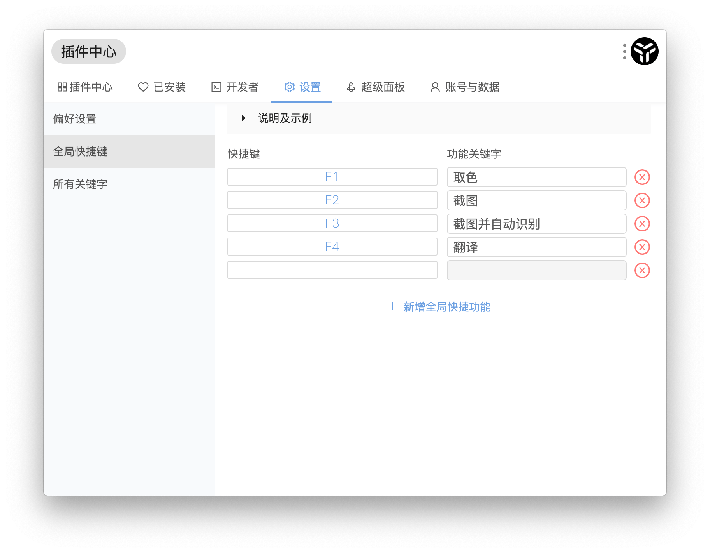

# 使用技巧

## ESC 键 快速回到主输入框

在任何进入插件后，可以通过 `esc` 快速回到初始状态。

## 窗口分离

uTools 插件都自带图形界面，或许有些时候你希望长时间使用某个插件，或是希望同时开启多个相同的插件，这个时候，你只需按 `ctrl + d`（ mac 下 `command + d` ），即可以将插件脱离 uTools 主输入框，把插件当成一个独立的应用程序来使用。

## 自动识别
安装对应的插件后，uTools 可以自动识别文本格式，并列出能够处理此文本的插件供你选择。

例如：
* 通过超级面板划词翻译：`复制一段英文`->`通过长按右键或者中键唤出超级面板`->`选择「翻译」插件`->`松开鼠标按键得到结果`。
* 通过输入框编辑  JSON ：`复制一段 json 字符串`->`呼出 uTools (会自动粘贴)`->`选择「 json 」插件`->`得到结果`。

## 全局快捷键
uTools 已经可以快速的辅助你解决一些小场景的问题，但是在使用很频繁的一些场景，合理的使用全局快捷键可以一键直达，快上加快。

首先，你需要在「 setting 」中配置全局快捷键，事例如下图：

* 设置 `F1 ` 为「取色」功能，按 `F1` 将进入取色模块。
* 设置 `F2` 为「截图」功能，将调用系统截图，截图内容将进入剪贴板。
* 设置 `F3` 为「截图并自动识别」功能，将调用系统截图，完成截图后，进入插件自动识别图片中的文字。
* 设置 `F4` 为「翻译」功能，当复制一段文本后，在5秒内按 `F4` 直接翻译复制的文本。

更多玩法等你探索

## 数据同步

uTools 是一个桌面应用程序，各插件所产生配置、内容都将保存在你本地数据库中。

但是你可能需要在公司、家里不同的设备上面使用 uTools ，或者为了预防重装系统等原因造成数据丢失。我们特别准备了云端实时同步备份服务，你可以在成为 uTools 会员 之后进入「设置」自助开启。